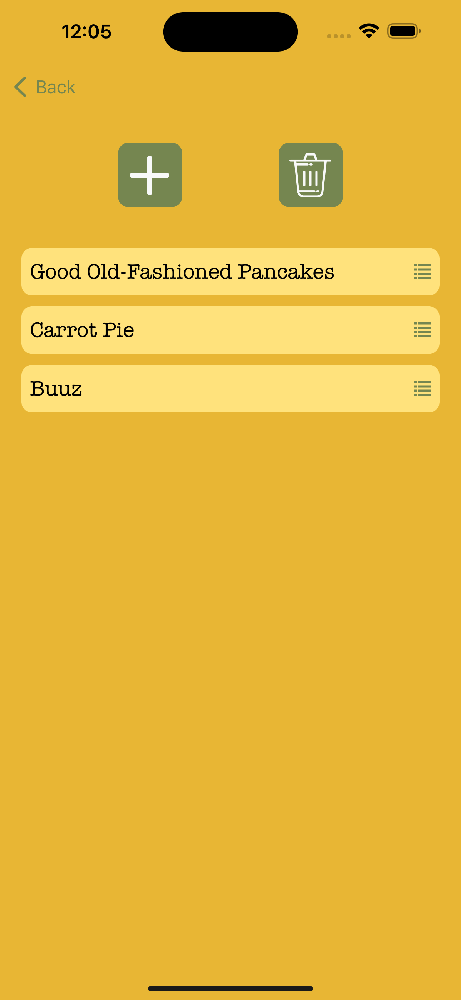
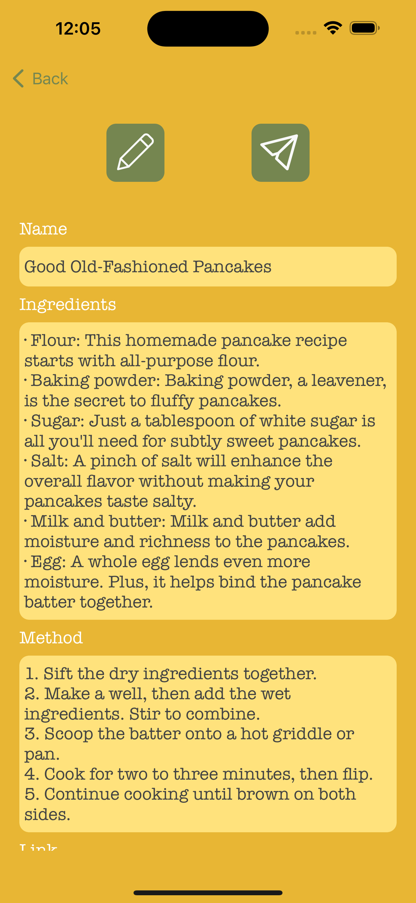
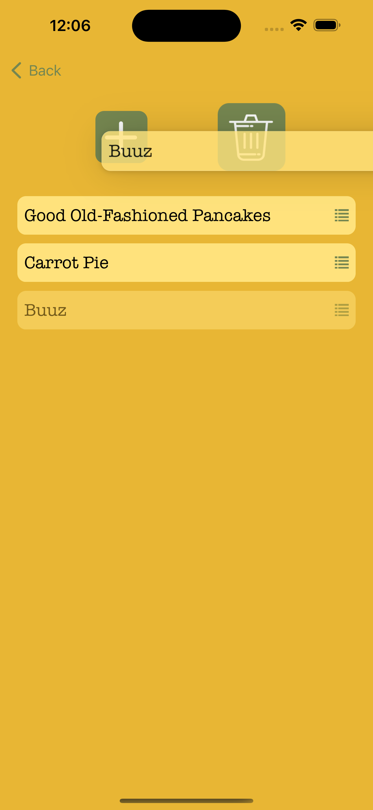

# RecipeApp
Should be gorgeous app for storing cooking recipes.
Design: Figma, UIKit
Language: Swift
Data storing: CoreData
Features: 
- Create recipes
- Edit recipes
- Share recipes
- Drag and drop to delete a recipe

AppStore link: https://apps.apple.com/app/recipes-keeper/id6450554239
## Screenshots

Here are some screenshots of my app in action:

<table>
  <tr>
    <td></td>
    <td></td>
    <td></td>
    <td></td>
  </tr>
</table>
